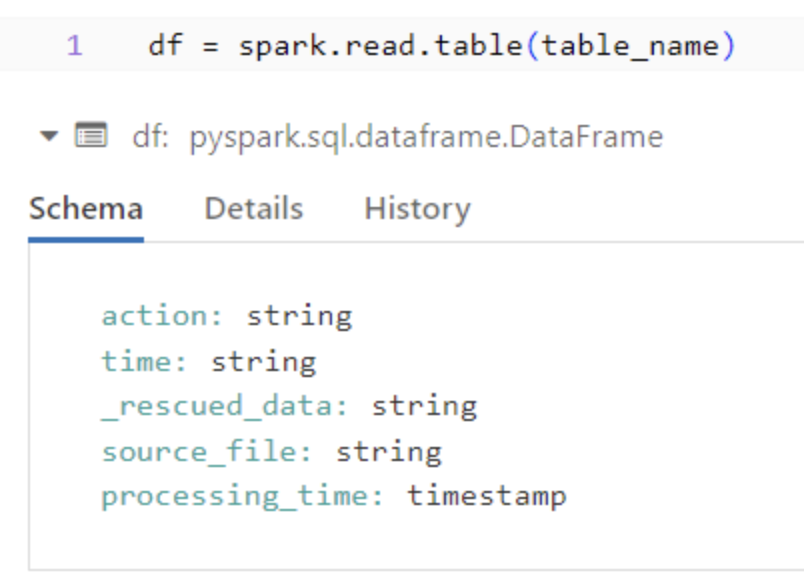
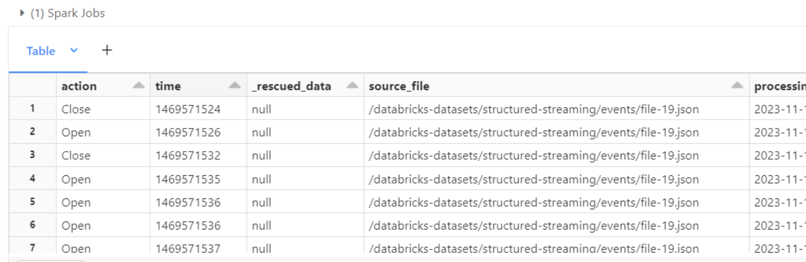
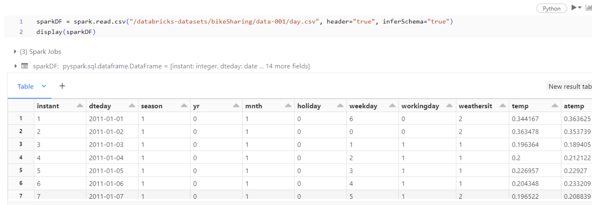

# IDS706-week11-databricks

Week 11: Data Pipeline with Databricks
## Requirements
- Create a data pipeline using Databricks
- Include at least one data source and one data sink
## Grading Criteria
- Pipeline functionality (20 points)
- Data source and sink configuration (20 points)
## Deliverables
- Databricks notebook or script
- Document or video demonstrating the pipeline


### Data Pipeline with Databricks
This project demonstrates a data pipeline using Databricks (which follows [the basic ETL pipeline tutorial](https://docs.databricks.com/en/getting-started/etl-quick-start.html#) from Databricks.). The pipeline includes a series of steps from ingesting data to visualizing it. Below are the details of each step as implemented in the Databricks notebook.

## Pipeline Steps
1. Environment Setup and Data Ingestion
The initial block of the notebook sets up the environment and prepares for data ingestion. The code performs the following actions:

- Imports functions from pyspark.sql.functions.

- Defines variables for file paths and table names.

- Clears any data from previous executions.

- Configures Auto Loader to ingest JSON data into a Delta table, adding metadata like the file path and current timestamp.

```python
# Import functions
from pyspark.sql.functions import col, current_timestamp

# Define variables used in code below
file_path = "/databricks-datasets/structured-streaming/events"
username = spark.sql("SELECT regexp_replace(current_user(), '[^a-zA-Z0-9]', '_')").first()[0]
table_name = f"{username}_etl_quickstart"
checkpoint_path = f"/tmp/{username}/_checkpoint/etl_quickstart"

# Clear out data from previous demo execution
spark.sql(f"DROP TABLE IF EXISTS {table_name}")
dbutils.fs.rm(checkpoint_path, True)

# Configure Auto Loader to ingest JSON data to a Delta table
(spark.readStream
  .format("cloudFiles")
  .option("cloudFiles.format", "json")
  .option("cloudFiles.schemaLocation", checkpoint_path)
  .load(file_path)
  .select("*", col("_metadata.file_path").alias("source_file"), current_timestamp().alias("processing_time"))
  .writeStream
  .option("checkpointLocation", checkpoint_path)
  .trigger(availableNow=True)
  .toTable(table_name))

```

2. Data Reading
After the data ingestion setup, the notebook reads the ingested data into a DataFrame for processing. This is a critical step for subsequent data manipulation and analysis. `df = spark.read.table(table_name)`
insert 1.png


3. Data Display
To verify the correct data ingestion and to get a quick look at the data, the display() function is called on the DataFrame. This visual representation is useful for immediate data inspection. `display(df)`


4. Reading CSV Data and Display
Additionally, the pipeline includes steps for reading a CSV file into another DataFrame. This step is crucial for working with structured data and enables quick data exploration and validation using the display() function.

```python
sparkDF = spark.read.csv("/databricks-datasets/bikeSharing/data-001/day.csv", header="true", inferSchema="true")

display(sparkDF)
```


### Run
- Navigate to the notebook and run each cell sequentially by pressing SHIFT+ENTER. 
- Ensure that you have the correct permissions and that the Databricks runtime environment is properly set up.
- To execute the pipeline on a schedule or trigger it manually, follow the steps in the "Job Scheduling" section below.

### Job Scheduling
To automate the execution of this data pipeline, you can schedule the notebook to run as a task:

- Within the notebook's header bar, find and click the Schedule button.

- Assign a distinctive name for the job in the Job name field.

- For scheduling, select the Manual option to trigger executions as required.

- From the Cluster dropdown menu, pick the cluster you previously set up.

- Finalize the setup by clicking Create.

- Once the job is created, initiate a run by clicking Run now in the subsequent window.

- To review the outcome of the job execution, click on the External Link icon, which is adjacent to the Last run timestamp.

- By setting up a job schedule, you ensure that the data pipeline runs reliably at your specified times or upon manual initiation, facilitating regular data processing and analysis.

### Conclusion
This README outlines the steps taken in the Databricks notebook to create a data pipeline from ingesting JSON data to reading and visualizing structured CSV data. Each code block is documented to explain its purpose and function within the pipeline.